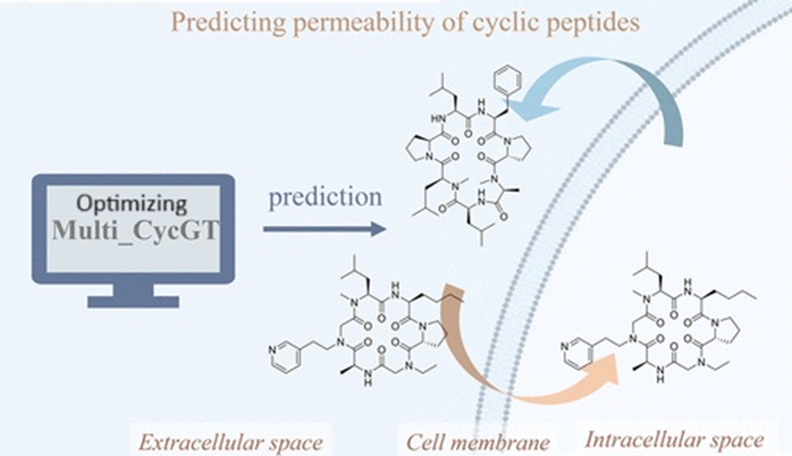

# Optimizing Transformer Models for Cyclic Peptide Permeability Prediction

## Inspiration
This project was motivated by the urgent need for new therapies and by the scientific challenge of making **cyclic peptides** viable as drug candidates.  
Cyclic peptides are promising because they are stable, selective, and can target "undruggable" proteins. Yet, one major barrier is **cell permeability** — whether a peptide can cross a cell membrane and actually reach its target.  

Experimental permeability testing is costly and slow. A reliable computational model could accelerate drug discovery, save resources, and expand treatment options for conditions ranging from infections to cancer.  
Our research contributes to this vision by optimizing **Transformer-based models** for peptide permeability prediction, offering a tool that can support scientists in identifying the most promising molecules.

---

## Research Validation
- Our dataset consists of ~7000 cyclic peptides with experimentally measured permeability values.  
- Data preprocessing included:
  - Handling overlaps between datasets  
  - Binarizing permeability values 
  - Preserving continuous values for regression experiments  

By framing permeability prediction as both a **classification** and **regression** problem, we captured more scientific nuance than many prior approaches.

---

## What Our Project Does (Differently)
Most computational peptide studies rely on **traditional QSAR methods** or simplified classifiers.  
Our work sets itself apart by:
- Implementing **multiple architectures** (Transformer, CNN, GCN, and their FC variants).  
- Evaluating **classification vs regression** approaches for permeability.  
- Exploring **chemistry-aware models** like Graphormer to better represent peptide structure.  
---

## How We Built It
- **Programming Language**: Python 3.9  
- **Frameworks**: PyTorch 2.5.0, TorchData  
- **Environment**: CUDA 11.8 on GPU  
---

## Challenges We Ran Into
- **Limited dataset size** made it difficult for large models to generalize.  
- **Unusual test performance** (test accuracy ~90% vs train/val ~60%) revealed potential dataset distribution issues.
- 
These challenges pushed us toward exploring regression and integrating chemical structure into the models.

---

## Accomplishments We Are Proud Of
- Built and compared six deep learning models for cyclic peptide permeability prediction.  
- Identified regression as a promising alternative to binary classification.  
- Established a collaborative bridge between **Computer Science and Chemistry departments**.  
- Gained deeper understanding of both biological complexity and computational limitations.  

---

## Future Directions
- Enlarge dataset by incorporating external peptide libraries.  
- Develop regression models for more interpretable predictions.  
- Work toward publishing findings to benefit the wider scientific community.  

---

---

## 📸 Project Workflow

